<!-- identity mark: a boot sequence — status readout checks itself off, alert
     panels bury it, then "Welcome / To / My / AI / World" each resolve and blow
     apart, before a loading bar fills and detonates into "KJ-AIML" extruded into
     a 3D slab and rasterized to ASCII. one static SVG, SMIL only, no JS.
     regenerate: python scripts/generate_wordmark.py
     — see docs/3d-ascii-wordmark.md -->

 
 

<b>AI Engineer · Founder</b> — Bangkok, remote-first

<h3><code>KJ@AI-INFRA ~ $ whoami</code></h3>

I build agent infrastructure, developer tools, and backend systems that make AI actually work — orchestration layers, agent skills, and the validation that keeps them honest in production.

The card below is the short version of the stack. The map beside it is the path a requirement takes through it: specification, orchestration, sandboxed execution, validation, ship.

<table>
  <tr>
    <td valign="top"></td>
    <td valign="top"></td>
  </tr>
</table>

<h3><code>KJ@AI-INFRA ~ $ ./systems.sh --public</code></h3>

Public repositories, linked to their source. Each one is a layer of the map above rather than a standalone demo.

| Repository | Layer | What it is |
| --- | --- | --- |
| [ALMS](https://github.com/KJ-AIML/alms) | spec → backend | An AI-first backend starter and CLI for building structured, observable applications with agent and infrastructure layers. |
| [ALMS LangGraph Agent Skill](https://github.com/KJ-AIML/alms-langgraph-agent-skill) | orchestration | An ALMS-style skill for building LangGraph and LangChain agent workflows. |
| [Helicopter Harness](https://github.com/KJ-AIML/helicopter-harness) | harness | A parent-workspace harness for multi-repo, multi-agent engineering work. |
| [Agent Native Backend](https://github.com/KJ-AIML/agent-native-backend) | reference | A field guide to production backend architecture for AI agents. |

<h3><code>KJ@AI-INFRA ~ $ ./contributions.sh</code></h3>

Generated from the public GitHub contribution endpoint and covering the displayed period only. Refreshed daily by GitHub Actions, without a personal access token.

<h3><code>KJ@AI-INFRA ~ $ ./links.sh</code></h3>

| | |
| --- | --- |
| GitHub | [@KJ-AIML](https://github.com/KJ-AIML) |
| LinkedIn | [Kongphop Jamreansuk](https://www.linkedin.com/in/kongphop-jamreansuk/) |
| Location | Bangkok |

<code>exit 0</code> — built as a self-contained profile artifact: local SVGs, deterministic generators, and a small public-data refresh pipeline. Notes in <a href="./docs/design-system.md">docs/design-system.md</a>.
