 

<h3><code>KJ@AI-INFRA ~ $ whoami</code></h3>

AI Engineer · Founder building agent infrastructure, developer tools, and backend systems that make AI actually work.

<table>
  <tr>
    <td valign="top"></td>
    <td valign="top"></td>
  </tr>
</table>

## Selected systems

I design orchestration layers, agent skills, backend systems, and validation workflows for production-oriented AI software. The projects below are public and linked directly to their source repositories.

- [ALMS](https://github.com/KJ-AIML/alms) — An AI-first backend starter and CLI for building structured, observable applications with agent and infrastructure layers.
- [Helicopter Harness](https://github.com/KJ-AIML/helicopter-harness) — A parent-workspace harness for multi-repo, multi-agent engineering work.
- [Agent Native Backend](https://github.com/KJ-AIML/agent-native-backend) — A field guide to production backend architecture for AI agents.
- [ALMS LangGraph Agent Skill](https://github.com/KJ-AIML/alms-langgraph-agent-skill) — An ALMS-style skill for building LangGraph and LangChain agent workflows.

## Contribution trace

The calendar below is generated from the public GitHub contribution endpoint and represents the displayed period only. It is refreshed by GitHub Actions without a personal access token.

## Contact / links

- GitHub: [@KJ-AIML](https://github.com/KJ-AIML)
- LinkedIn: [Kongphop Jamreansuk](https://www.linkedin.com/in/kongphop-jamreansuk/)
- Location: Bangkok

Built as a self-contained profile artifact: local SVGs, deterministic generators, and a small public-data refresh pipeline.
